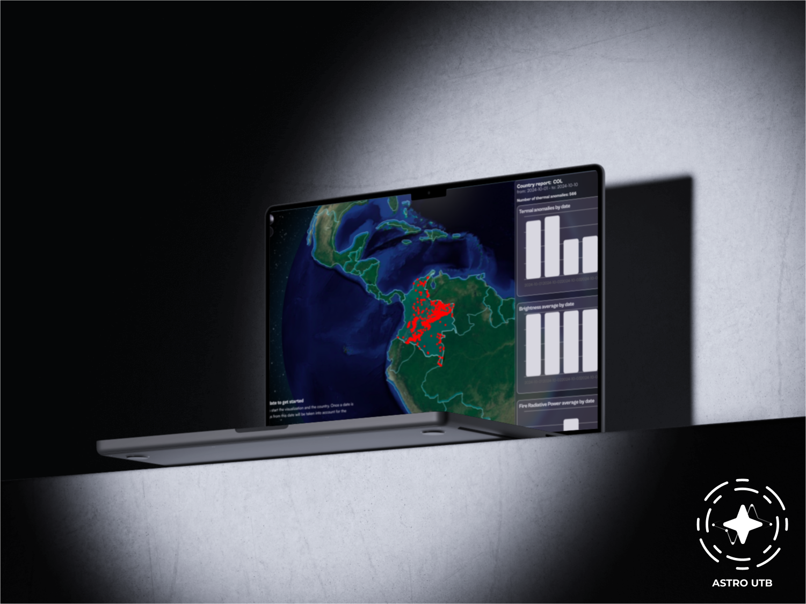

<!-- Improved compatibility of back to top link: See: https://github.com/othneildrew/Best-README-Template/pull/73 -->
<a id="readme-top"></a>
<!--
*** Thank you for reviewing this README. If you have any suggestions
*** that could improve this document, please fork the repository and create a pull request
*** or simply open an issue with the "enhancement" label.
*** Don't forget to give the project a star!
*** Thanks again! Now go and create something AMAZING! :D
-->

<!-- PROJECT SHIELDS -->
<!--
*** We use "reference" style links in markdown to improve readability.
*** Reference links are enclosed in square brackets [ ] instead of parentheses ( ).
*** See the end of this document for the declaration of reference variables
*** for contributors-url, forks-url, etc. This is an optional and concise syntax you can use.
*** https://www.markdownguide.org/basic-syntax/#reference-style-links
-->

[](#)
[](#)
[](#)
-brightgreen)
[](#license)
[](#)
[](#)

[](https://x.com/intent/tweet?text=Check%20out%20this%20project%20on%20GitHub:%20https://github.com/your_user/your_repository%20%23EarthConnect%20%23Wildfires%20%23AirQuality)
[](https://www.facebook.com/sharer/sharer.php?u=https://github.com/your_user/your_repository)
[](https://www.linkedin.com/sharing/share-offsite/?url=https://github.com/your_user/your_repository)
[](https://www.reddit.com/submit?title=Check%20out%20this%20project%20on%20GitHub&url=https://github.com/your_user/your_repository)
[](https://t.me/share/url?url=https://github.com/your_user/your_repository&text=Check%20out%20this%20project%20on%20GitHub)

:star: Give us a star on GitHub — it motivates us a lot!

<!-- PROJECT LOGO -->
<br />
<div align="center">
  <a>
    
  </a>

  <h3 align="center">EarthConnect: Wildfire and Air Quality Explorer</h3>

  <p align="center">
    Connect with the Earth: Real-time wildfires and air quality
    <br />
    <a href="https://earthconnect.vercel.app/"><strong>EarthConnect Web Application 🖥️</strong></a>
    <br />
  </p>
</div>

<!-- TABLE OF CONTENTS -->
<details>
  <summary>Table of Contents</summary>
  <ol>
    <li>
      <a href="#about-the-project">About the project</a>
      <ul>
        <li><a href="#goals">Goals</a></li>
        <li><a href="#motivation">Motivation</a></li>
        <li><a href="#purpose">Purpose</a></li>
        <li><a href="#features">Features</a></li>
        <li><a href="#implementation-details">Implementation Details</a></li>
        <li><a href="#built-with">Built with</a></li>
      </ul>
    </li>
    <li>
      <a href="#satellites-and-sensors-description">Satellites and Sensors Description</a>
      <ul>
        <li><a href="#viirs-noaa-20">VIIRS NOAA 20</a></li>
        <li><a href="#modis-terra-and-aqua">MODIS Terra & Aqua</a></li>
        <li><a href="#sentinel-2">SENTINEL-2</a></li>
        <li><a href="#openweather-api">OpenWeather API</a></li>
      </ul>
    </li>
    <li>
      <a href="#development-team">Development Team</a>
    </li>
    <li>
      <a href="#prerequisites">Prerequisites</a>
    </li>
    <li>
      <a href="#getting-started">Getting Started</a>
      <ul>
        <li><a href="#installation">Installation</a></li>
      </ul>
    </li>
    <li>
      <a href="#deployment-on-vercel">Deployment on Vercel</a>
    </li>
    <li>
      <a href="#learn-more">Learn More</a>
    </li>
    <li><a href="#contributions">Contributions</a></li>
    <li><a href="#contact">Contact</a></li>
    <li><a href="#acknowledgments">Acknowledgments</a></li>
  </ol>
</details>

<!-- ABOUT THE PROJECT -->
## About the project

<div align="center">
  <a>
    
  </a>
</div>

**Discover how wildfires affect the air we breathe. Explore real-time data, visualize the impact, and take action for a healthier planet.**

### Goals

- Provide an immersive and interactive experience to visualize wildfires globally.
- Connect wildfire events with air quality data (NO2, CO2, among others) to understand their impact.
- Facilitate data-driven analysis and decision-making using real-time satellite and weather data.

### Motivation

The increase in the frequency and intensity of wildfires globally is affecting health and the environment. Our application aims to provide a powerful tool for users to understand how these disasters influence air quality and ultimately impact the daily lives of millions of people.

### Purpose

This application will allow you to explore the direct relationship between wildfires and the air we breathe. Through visualizations and real-time data, we seek to raise public awareness about the impact of wildfires and provide a valuable resource for researchers, environmentalists, and citizens committed to a sustainable future.

### Features

- Real-time visualization of wildfires using satellite data from VIIRS NOAA 20, MODIS, and SENTINEL.
- Air quality analysis using data from OpenWeather and NASA APIs.
- Provide users with analytical tools to understand the interconnection between atmospheric variables and climate events.
- A resource that allows users to customize visualizations to explore how a specific region is being affected by wildfires and air quality.

This is a [Next.js](https://nextjs.org/) project bootstrapped with [`create-next-app`](https://github.com/vercel/next.js/tree/canary/packages/create-next-app).

### Implementation Details

The project uses Next.js for the frontend and Python for data processing. Satellite data is obtained through NASA and OpenWeather APIs.

For more details on the implementation, check the source code files in the repository.

### Built with

* [![Next][Next.js]][Next-url]
* [![React][React.js]][React-url]
* [![Python][Python]][Python-url]
* 

## Satellites and Sensors Description

### VIIRS NOAA 20

The **VIIRS (Visible Infrared Imaging Radiometer Suite)** aboard the NOAA-20 satellite provides high-resolution observations of the Earth's surface, enabling detection of forest fires and measurement of aerosols and gases in the atmosphere.

### MODIS Terra & Aqua

The **MODIS (Moderate Resolution Imaging Spectroradiometer)** is a set of sensors located on the Terra and Aqua satellites that provide daily images of the Earth's surface, observing forest fires, changes in vegetation and atmospheric parameters related to air quality.

### SENTINEL-2

The **SENTINEL-2** satellites of the Copernicus Program provide high-resolution optical imagery to monitor vegetation, land use and manage disasters such as forest fires. SENTINEL data are essential for tracking environmental impact.

### OpenWeather API

OpenWeather's **API** is a key source for integrating air quality data such as NO2, CO2 and other pollutants, connecting wildfire events with atmospheric conditions.

## Development Team

The application was developed by a talented team of students from the Systems Engineering program of the **Universidad Tecnológica de Bolívar (UTB)**, who are also members of the **Semillero de Investigación en Astronomía y Ciencia de Datos** de la Facultad de Ciencias Básicas. The team members are:

- **Daniel David Herrera Acevedo**
- **David Josué Ruiz Morales** 
- **Jesús David Petro Ramos**
- **Andrés Felipe García Teherán** 
- **David Sierra Porta** 

The seedbed seeks to foster research in areas related to astronomy and data science, providing students with opportunities to develop innovative technological solutions to global challenges. Learn more about the group at the following link: [Semillero de Astronomía y Ciencia de Datos](https://www.utb.edu.co/investigacion/apoyo-a-la-investigacion/semilleros-de-investigacion/semillero-astronomia-ciencia-de-datos/).

## Prerequisites

- Node.js (>=14.0.0)
- Python (>=3.6)
- Git
- Access to APIs used in the project

## Getting Started

To run this project locally, follow these steps:

### Installation

1. Clone the repository:
   ```bash
   git clone https://github.com/TheSkyLabTeam/Terra.git
   ```
2. Navigate to the project directory:
   ```bash
   cd Terra
   ```
3. Install the dependencies:
   ```bash
   npm install
   ```
4. Run the application:
   ```bash
   npm run dev
   ```

## Deployment on Vercel

To deploy this application on Vercel, follow these steps:

1. Ensure your project is ready for deployment. Check for any build errors.
2. Sign in to [Vercel](https://vercel.com/) and create a new project.
3. Link your GitHub repository to Vercel.
4. Set the environment variables required for your application (e.g., API keys).
5. Deploy!

## Learn More

To learn more about the technologies used in this project, you can check the following links:

- [Next.js Documentation](https://nextjs.org/docs/getting-started)
- [React.js Documentation](https://reactjs.org/docs/getting-started.html)
- [Python Documentation](https://www.python.org/doc/)
- [OpenWeather API Documentation](https://openweathermap.org/api)

<!-- CONTRIBUTING -->
## Contributions

Contributions are what make the open source community an amazing place to learn, inspire and create. Any contribution you make will be **very much appreciated**.

If you have any suggestions that could improve this project, please make a fork of the repository and create a pull request. You can also open an issue with the “enhancement” tag.

Don't forget to give the project a star ⭐ Thanks again! 🙌

1. Make a fork to the project (<https://github.com/tu_usuario/earthconnect>).
2. Create your feature branch (git checkout -b feature/AmazingFeature).
3. Make your changes (git commit -m 'Add some AmazingFeature')
4. Push to the branch (git push origin feature/AmazingFeature)
5. Open a Pull Request

## Contact

- **Daniel David Herrera Acevedo** - [acevedod@utb.edu.co](mailto:acevedod@utb.edu.co)
- **David Josué Ruiz Morales** - [daruiz@utb.edu.co](mailto:daruiz@utb.edu.co)
- **Jesús David Petro Ramos** - [jpetro@utb.edu.co](mailto:jpetro@utb.edu.co)
- **Andrés Felipe García Teherán** - [teherana@utb.edu.co](mailto:teherana@utb.edu.co)
- **David Sierra Porta** - - [dporta@utb.edu.co](mailto:dporta@utb.edu.co)

## Acknowledgments

- Thanks to NASA for providing valuable satellite data.
- Special thanks to OpenWeather for their accurate weather data.
- Acknowledgments to the developers who contributed to this project and to all those who support open-source initiatives.

<!-- MARKDOWN LINKS & IMAGES -->
[Next.js]: https://img.shields.io/badge/Next.js-000000?style=for-the-badge&logo=nextdotjs&logoColor=white
[Next-url]: https://nextjs.org/
[React.js]: https://img.shields.io/badge/React-61DAFB?style=for-the-badge&logo=react&logoColor=black
[React-url]: https://reactjs.org/
[Python]: https://img.shields.io/badge/Python-3776AB?style=for-the-badge&logo=python&logoColor=white
[Python-url]: https://www.python.org/